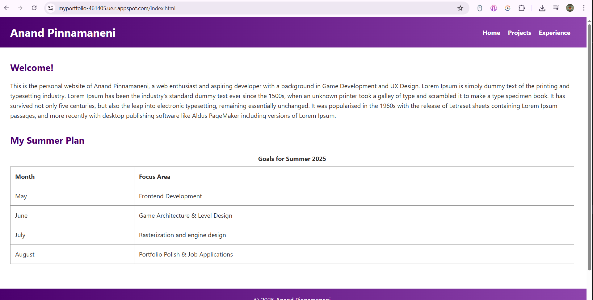
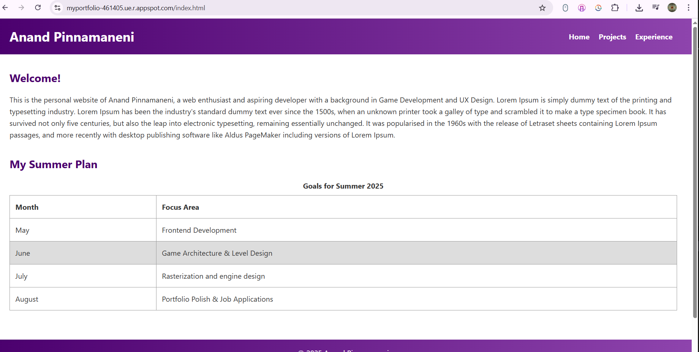
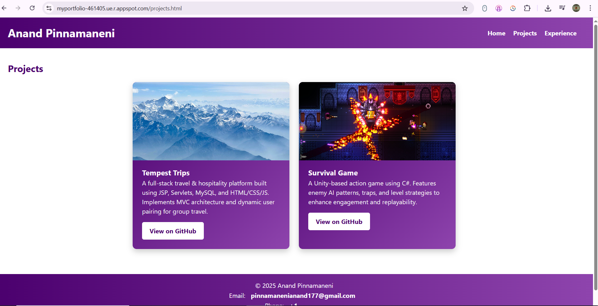
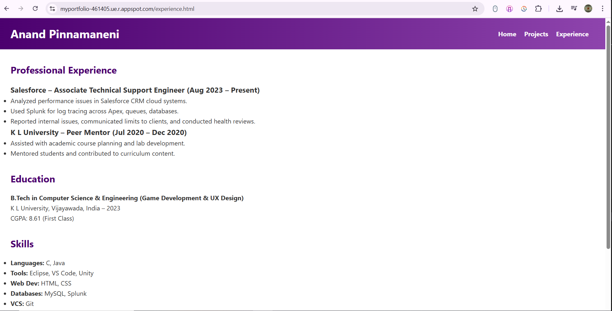
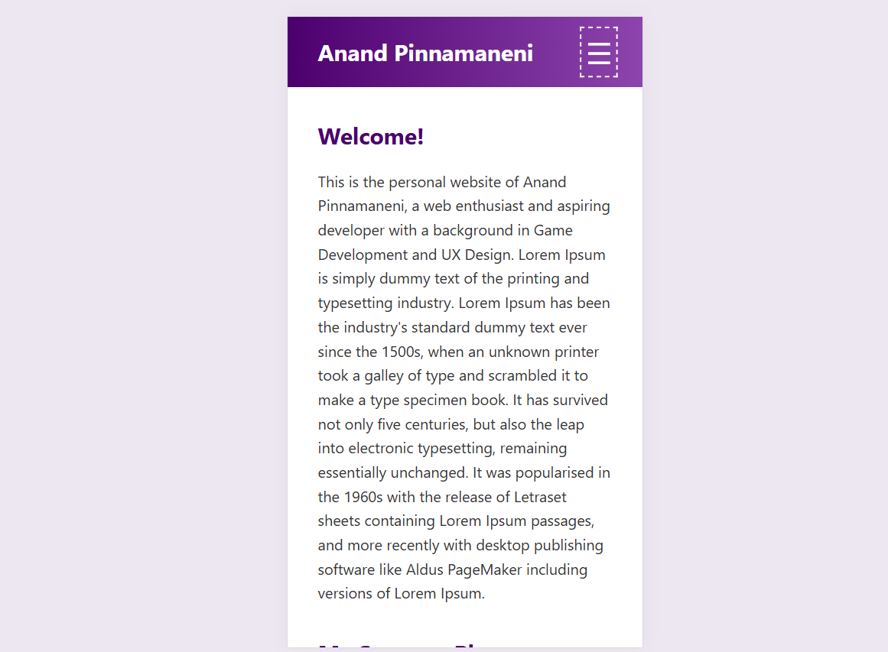
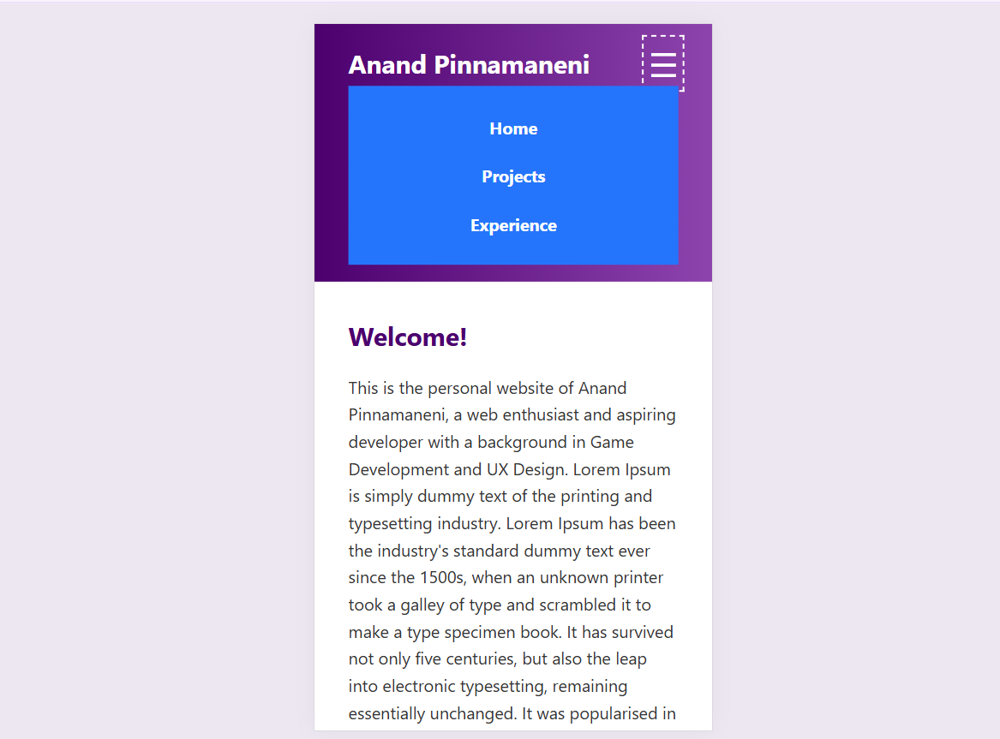
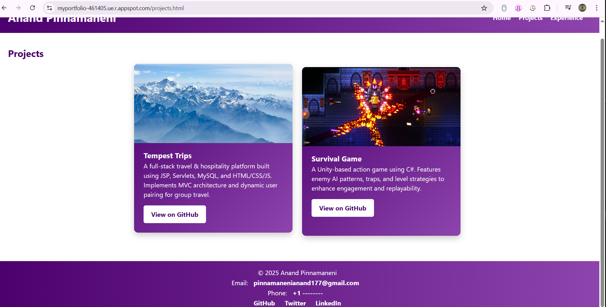

# Anand Pinnamaneni | Personal Website

## Live Site
[Visit the Live Website on Google Cloud App Engine](https://myportfolio-461405.ue.r.appspot.com/index.html)

## Description
This is the personal portfolio website of **Anand Pinnamaneni**, showcasing his interests and background in **Web Development, Game Architecture, and UX Design**. Built with HTML, CSS, and vanilla JavaScript, the site is responsive, interactive, and cleanly structured to emphasize usability and modern design.

---

## Pages Overview

### Home Page
- **Features** a brief introduction and a table listing a weekly schedule of current professional and creative activities.
- Contains Header and footer being the consistant in all pages, which contain the external and internal links.
- Header contains the internal links to projects and experiences pages 
- Footer contains the external links which can be accessed by clicking on Github,Linkdin and Twitter , these redirect to the respective websites(not linking to any of mine).
- This page also contains a table , which **highlights**(turns light grey) the rows when the mouse hovers over them.
- **Screenshot:**  
  
  

---

### Projects Page
- Displays multiple projects in card format with **hover effects**, project descriptions, and **GitHub buttons** that link to repositories(empty repos - for the function of the button, which are also external links).
- Project cards use a color scheme matching the header gradient for visual consistency.
- **Screenshot:**  
  

---

### Experience Page 
- A section to detail professional or academic experiences.
- Follows the same visual design system as the rest of the site.
- **Screenshot:**  
  

---

## Interaction Features Explained

- **Responsive Hamburger Menu**:  
  On small screens, a hamburger (`☰`) button toggles the visibility of the navigation menu.
  - Implemented with JavaScript and styled to match the site’s theme.
  
  

- **Hover Interaction**:  
  Project cards animate slightly  on hover to provide interactive feedback.
   

- **Custom Footer**:  
  Includes social media links, as well as email and phone contact info, all styled to match header navigation.

- **Mobile Responsive Layout**:  
  Layout and text adapt fluidly to different screen sizes via media queries.

---

## Technologies Used
- HTML
- CSS 
- JavaScript (for menu toggle and line highlight)
- Deployed on **Google Cloud App Engine**

---

## Contact
- **Email**: [pinnamanenianand177@gmail.com](pinnamanenianand177@gmail.com)  
- **Phone**: +1 ----------  
- 

---

